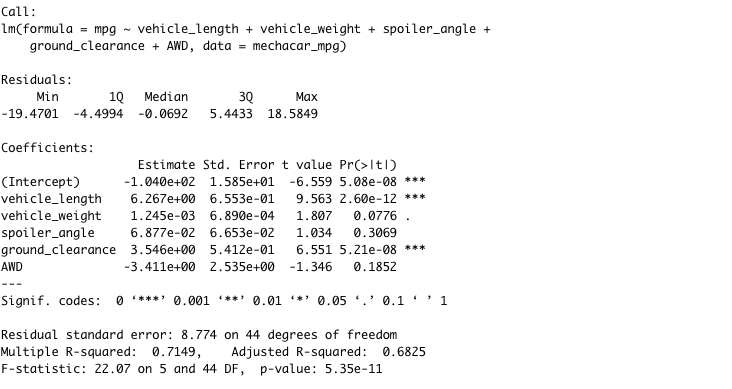

# MechaCar_Statistical_Analysis

## Linear Regression to Predict MPG

1) According to the linear regression summary above, we can look at the Pr(>|t|) values to determine which variables are statistically unlikely to provide random amounts of variance. In this particular case, vehicle_length and ground_clearance have Pr(>|t|) values less than 0.05. Therefore, these two variables are statistically likely to provide non-random amounts of variance to the mpg values in the dataset. 
2) The p-value of the summary shows that there is a significant relationship between independent and dependent variables, therefore the slope of the linear model is not considered to be zero.
3) The R-squared value determines the strength of the relationship between the linear model and the dependent variable, mpg of MechaCar prototypes. The summary indicates that the R-squared value is 0.7149, which is a strong correlation. Therefore, this linear model effectively predicts the mpg of MechaCar prototypes. 

----

## Summary Statistics on Suspension Coils

1) The summary above shows the mean, median, variance and standard deviation of PSI values across all manufacturing lots. The design specifications indicate that the variance of suspension coils must not exceed 100 pounds per square inch. The variance for all manufacturing lots is 62.29356, therefore satisfying the design specifications. 

1) The summary above shows the mean, median, variance and standard deviation of PSI values for each manufacturing lot (Lot1, Lot2, Lot3). The variance for Lot1 and Lot2 are 0.9795918 and 7.4693878, respectively. These variance values meet the design specifications. However, the variance of Lot3 PSI values is 170.2861224m which exceeds the design limits. This large variance indicates that the Lot3 values are far from the mean and also from each other. 

----

## T-Tests on Suspension Coils
The t-test is used to determine whether there is a statistical difference between the mean of a sample dataset and the mean of potential population dataset. In this project, we determined the statistical difference between PSI across manufacturing lots and the population mean of 1500 pounds per square inch. 

